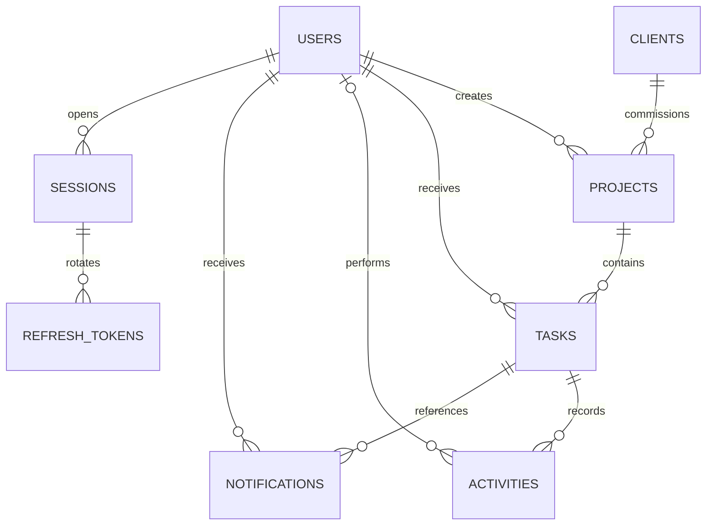

# Architecture and data model

## Relationships

Foreign keys restrict deletion of referenced clients, projects, developers, and activity actors. Project archiving and account deactivation preserve that history. Statuses, priorities, and roles use PostgreSQL enums; overdue is an independent flag rather than a fifth status. UTC dates and timezone-aware activity timestamps have different jobs and are stored accordingly.

## Read boundaries

Admin queries have global scope. PM queries require `projects.created_by = current_user.id`. Developer queries require `tasks.assigned_to = current_user.id`. These predicates are shared by task lists, detail fetches, dashboards, activity, notifications, and live audiences. Resource lookups return 404 when the caller cannot access the resource, avoiding a separate existence signal. Role-disallowed actions return 403.

Developer project summaries count only their own tasks. They contain project identity and name, not client details, the project brief, or other developers' totals. Managers receive only the small client/developer directory needed to create and assign work. They cannot change project ownership.

## Authentication

Passwords use bcrypt with a work factor of 12. Access tokens expire after 15 minutes and exist only in JavaScript memory. Refresh tokens use a separate signing secret and a seven-day absolute session deadline, and live in a host-only HttpOnly cookie restricted to `/api/auth`. Production cookies are Secure; SameSite is configurable for the chosen host arrangement.

The server validates signature, algorithm, issuer, audience, and token type. It then reads the current account and session from PostgreSQL. A forged role claim never overrides the database role. Deactivated users and revoked sessions stop authenticating immediately.

Refresh rotation locks the session row, marks the presented token as used, and inserts the successor token hash in one transaction. Reuse of a consumed refresh token revokes the entire session. The frontend serializes refresh requests in a tab and uses the Web Locks API to coordinate tabs sharing a cookie. No access or refresh token is stored in localStorage; only the activity cursor is.

Cookie-authenticated endpoints require an exact configured Origin and the non-simple `X-Requested-With: Fieldwork` header. JSON bodies, allowed origins, rate limits, and HttpOnly/Secure cookie settings reinforce this boundary. API writes require Bearer authentication. The database URL uses the provider's TLS settings in production; certificate checking should not be disabled.

## Mutation and delivery

A task update, its activity rows, and assignment/review notifications commit together. An optimistic version check prevents two editors from silently overwriting each other. Completing a task or moving its due date forward clears an existing overdue flag; only the background job sets new overdue flags.

An advisory transaction lock serializes event-producing transactions. A sequence alone is insufficient for catch-up: transaction A could allocate ID 10, transaction B could commit ID 11, and a client could advance past A before it commits. Serializing these small agency-level writes makes activity ID order equal commit order. The trade-off is lower write throughput, acceptable for this scope.

Socket.IO is configured for WebSocket transport only. It handles reconnect backoff and heartbeat behavior without the code needed for a native implementation. Authentication happens before connection. The server chooses private user rooms; the client has no room-join API. Existing socket sessions are revalidated before publication. Socket lifetime is bounded by access-token expiry.

The socket sends an authorized change signal; React Query then refetches the scoped database view. This is event-driven fetching, not interval polling. Notification messages also carry the updated unread count. A reassignment sends a content-free invalidation to the previous assignee so stale views can be removed without revealing the replacement assignee.

On connection, the client requests `/activity?after=<lastCursor>`. One repeatable-read transaction returns the latest 20 visible missed events and a high-water mark. Events arriving during this request trigger another synchronization pass. The feed and task views then reconcile from the database. Neither history nor offline catch-up depends on Socket.IO's memory cache.

Presence is a map of user IDs to active socket IDs. Two tabs from the same person count as one. Only administrators receive the count. Disconnect and token-expiry handlers remove connections.

## Scheduler

node-cron runs once per minute in UTC, with overlapping executions disabled. The job also runs at startup to catch deadlines missed during downtime. It atomically flags incomplete, previously unflagged tasks with past due dates and records a Scheduler activity. Re-running it does not duplicate overdue events. Bull would add Redis and a second operational service for a single repeatable job; it becomes worthwhile with durable retry requirements or a larger job workload.

## Index decisions

| Index                                      | Query it supports                              |
| ------------------------------------------ | ---------------------------------------------- |
| Unique lower-case user email               | Login and duplicate-account protection         |
| Project owner                              | PM ownership filtering                         |
| Project client                             | Client relationships and lookup joins          |
| Task project/status                        | Project task lists and dashboard grouping      |
| Task assignee/priority descending/due date | Developer scope and default task order         |
| Open task due date, partial                | Scheduled overdue scan without completed tasks |
| Task priority                              | Priority filters and summaries                 |
| Activity task/ID descending                | Scoped task history and recent catch-up        |
| Notification user/ID descending            | Most recent notifications                      |
| Unread notification user, partial          | Badge counts and read-all updates              |
| Session user and refresh-token session     | Session invalidation and token-family cleanup  |

Primary-key indexes cover task IDs and global activity cursor ranges. Indexes on every filter combination would make writes more expensive without evidence of a matching workload. For larger datasets, use representative query plans before adding compound indexes.

## Scaling next

The next change would be a PostgreSQL outbox written in the task transaction. A dispatcher could retry delivery without losing notifications between commit and publication. Before multiple API instances, add shared Socket.IO room coordination, distributed presence, shared rate limiting, and one scheduler leader. Session/token retention and activity pagination are also natural next steps.
